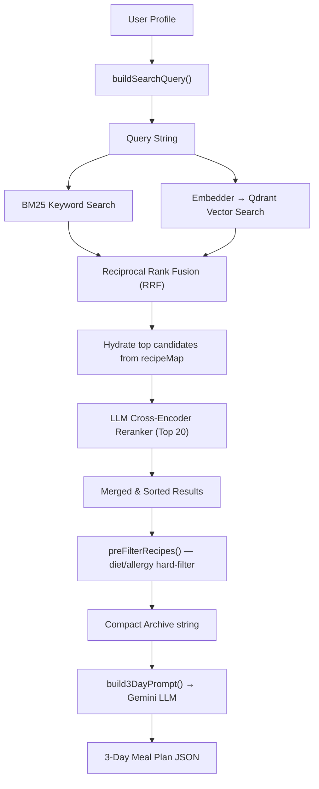

# Clara AI — RAG Pipeline Component Analysis

> Complete breakdown of every component in the Hybrid RAG system, its current logic, and concrete areas where **output quality** and **efficiency** can be improved.

---

## End-to-End Data Flow (Current)



---

## 1 · Embedding Model — `embedder.js`

| Property | Current Value |
|---|---|
| **Model** | `gemini-embedding-2` (Google) |
| **Dimensions** | 768 (explicitly set via `outputDimensionality`) |
| **SDK** | `@ai-sdk/google` + Vercel AI SDK (`embed` / `embedMany`) |
| **Batch API** | `embedBatch()` — used during indexing |
| **Single API** | `embedText()` — used at query time |
| **Zero-vector fallback** | If input text is empty/null → returns `float[768]` of zeros |

### Current Logic
```
embedText(text) → Google API → float[768]
embedBatch(texts[]) → Google API → float[768][]
```
- At **index time**: every recipe is converted to a searchable text string via `buildRecipeText()`, then batch-embedded in groups of 50.
- At **query time**: the user-profile search query is embedded once to produce a single 768-dim vector.

### 🔴 Improvement Areas

| Area | Problem | Potential Fix | Impact |
|---|---|---|---|
| **Embedding text quality** | `buildRecipeText()` concatenates fields with `\|` pipes — this is a flat, unstructured string that loses semantic hierarchy | Use a more natural-language template: *"Paneer Tikka is a North Indian vegetarian snack with 220 calories, 18g protein. Tags: high-protein, gluten-free."* | **+Quality**: Embeddings will capture meaning better |
| **Query–Document asymmetry** | The query is a profile string like `"Vegetarian South Indian cuisine weight loss"` but documents are recipe descriptions — these live in different semantic spaces | Use **query prefixes** (e.g., `"search_query: ..."` and `"search_document: ..."`) if the model supports it, or craft the query as a "describe the ideal recipe" sentence | **+Quality**: Better cosine similarity alignment |
| **Dimensionality** | 768 dims is the default; `gemini-embedding-2` supports up to 3072 | Experiment with 1024 or 1536 dims — higher dims capture more nuance at the cost of storage/speed | **+Quality** (marginal) / **−Efficiency** tradeoff |
| **No caching of query embeddings** | Every `hybridSearch()` call embeds the query fresh, even if the same profile produces the same query string | Add an LRU cache keyed on query string hash | **+Efficiency**: Saves ~200ms + 1 API call per repeated query |
| **Empty-text fallback** | Returns a zero vector — this will match poorly against everything but won't crash | Consider throwing an error or logging a warning instead of silently returning garbage | **+Quality**: Prevents silent bad matches |

---

## 2 · Qdrant Vector Store — `qdrantConfig.js` + `recipeIndexer.js`

| Property | Current Value |
|---|---|
| **Collection** | `bn_recipes` (env: `QDRANT_COLLECTION`) |
| **Vector size** | 768 |
| **Distance metric** | Cosine |
| **Index type** | Default HNSW (Qdrant auto) |
| **Payload stored** | `slug, title, category, cuisine, recipe_type, calories, protein, carbs, fat, textHash` |
| **Point ID** | MD5 of slug, formatted as UUID |
| **Search limit** | 100 results per query |

### Current Logic
```
indexRecipes():
  1. Check if collection exists → create if not (768-dim, Cosine)
  2. Check points_count — if >= (recipes.length - 100), SKIP re-embedding
  3. Otherwise, batch-embed in chunks of 50 → upsert to Qdrant

searchEmbedding():
  → client.search(collection, { vector, limit, with_payload: true, filter? })
```

### 🔴 Improvement Areas

| Area | Problem | Potential Fix | Impact |
|---|---|---|---|
| **No HNSW tuning** | Using Qdrant default HNSW params (`m=16, ef_construct=100`) — these are general-purpose defaults | For a ~1300-doc corpus, increase `ef` at search time to 128+ for higher recall; `m=16` is fine for this size | **+Quality**: Higher recall from ANN search |
| **No payload indexing** | Fields like `cuisine`, `category`, `recipe_type` are stored but **not indexed** — Qdrant filter on unindexed fields does full scan | Create payload indexes: `client.createPayloadIndex(collection, 'cuisine', 'keyword')` etc. | **+Efficiency**: Faster filtered searches |
| **Stale-data detection** | The skip-reindex check (`existingPointsCount >= recipes.length - 100`) has a 100-recipe tolerance — if recipe *content* changes but count stays the same, stale embeddings persist | Compare `textHash` stored in payload against current `buildRecipeText()` hash; only re-embed changed recipes | **+Quality**: Ensures embeddings match current recipe data |
| **No Qdrant filter usage** | `hybridSearch()` passes `qdrantFilter = null` — the filter parameter is accepted but **never used** in the actual call from `recipeSelection.js` | Pass diet-type and cuisine as Qdrant filters to **pre-narrow** vector search, reducing irrelevant candidates | **+Quality** + **+Efficiency**: Fewer irrelevant results enter the pipeline |
| **Search limit = 100** | Retrieving 100 vectors for a 1300-doc corpus means scanning ~8% of all docs — overkill for the top-20 reranker downstream | Reduce to 50 (matches BM25's effective contribution after RRF) | **+Efficiency**: Fewer payloads transferred |
| **No quantization** | Vectors are stored as full `float32` — for 1300 docs this is fine, but for future scale... | Enable scalar quantization in Qdrant config if corpus grows past 10K | **+Efficiency** (future) |

---

## 3 · BM25 Keyword Search — `bm25.js`

| Property | Current Value |
|---|---|
| **Algorithm** | Classic BM25 (Okapi) |
| **Parameters** | `k1 = 1.5`, `b = 0.75` |
| **Stop words** | 19 English words (the, a, an, is, in, on, of, and, or, for, with, to, from, by, at, this, that, it, its) |
| **Tokenizer** | Lowercase → strip punctuation → split whitespace → remove stop words |
| **Storage** | In-memory inverted index (`Map<token, Map<docId, tf>>`) |
| **Search limit** | 100 results (called with `topK=100` from `hybridRetriever.js`) |
| **Rebuild policy** | Always rebuilt on `indexRecipes()` — no persistence |

### Current Logic
```
tokenize(text):
  lowercase → replace [^a-zA-Z0-9_] with space → split on whitespace → remove stop words

BM25 Score = Σ(for each query term):
  IDF = log((N - df + 0.5) / (df + 0.5) + 1)
  TF_norm = (tf * (k1 + 1)) / (tf + k1 * (1 - b + b * (docLen / avgDocLen)))
  termScore = IDF × TF_norm
```

### 🔴 Improvement Areas

| Area | Problem | Potential Fix | Impact |
|---|---|---|---|
| **No stemming** | "proteins" won't match "protein", "grilled" won't match "grilling" — exact token match only | Add a lightweight Porter stemmer (e.g., `stemmer` npm package or a 50-line implementation) | **+Quality**: Significantly better keyword recall |
| **No synonyms / expansion** | "roti" won't match "chapati", "paneer" won't match "cottage cheese" | Add a domain-specific synonym map: `{ "roti": ["chapati", "phulka"], "paneer": ["cottage cheese"] }` | **+Quality**: Critical for Indian cuisine domain |
| **Tiny stop-word list** | Only 19 words — common food-irrelevant words like "recipe", "healthy", "make", "cook" will pollute scores | Expand to ~50-100 stop words including domain noise words | **+Quality**: Cleaner BM25 scores |
| **No n-gram / phrase matching** | "dal makhani" as a query becomes two separate tokens — a doc with "dal" and "makhani" in different contexts would match | Add bigram support for known compound food terms | **+Quality**: Better precision for multi-word dish names |
| **Default BM25 params** | `k1=1.5, b=0.75` are textbook defaults — they may not be optimal for short recipe documents (~30-50 tokens) | Tune: for short docs, try `b=0.4` (reduce length normalization penalty) and `k1=1.2` | **+Quality**: Better scoring for short-document corpus |
| **Search limit overkill** | Returns top 100 but RRF only meaningfully uses the top ~30 (ranks beyond that contribute negligible RRF score) | Reduce to `topK=50` | **+Efficiency**: Marginal |
| **No term weighting** | All query terms are weighted equally — but "paneer" is far more discriminative than "Indian" | Apply IDF-based query term weighting or boost specific fields (title match > tag match) | **+Quality**: More relevant top results |

---

## 4 · Reciprocal Rank Fusion (RRF) — `hybridRetriever.js`

| Property | Current Value |
|---|---|
| **Constant k** | 60 (standard) |
| **Input 1** | BM25 top-100 results (ranked by BM25 score) |
| **Input 2** | Qdrant top-100 results (ranked by cosine similarity) |
| **Output** | Merged list sorted by RRF score |

### Current Logic
```
For each result list:
  rrfScore(doc) += 1 / (k + rank)

Final = sort all docs by total rrfScore DESC
```

### 🔴 Improvement Areas

| Area | Problem | Potential Fix | Impact |
|---|---|---|---|
| **Equal weighting** | BM25 and Qdrant contribute equally to RRF — but for semantic queries like "weight loss suitable recipes", vector search should dominate; for specific queries like "paneer tikka", BM25 should dominate | Add **weighted RRF**: `α * (1/(k+rank_bm25)) + β * (1/(k+rank_qdrant))` with configurable weights (e.g., α=0.4, β=0.6) | **+Quality**: Query-type-adaptive fusion |
| **Fixed k=60** | k=60 is standard for large corpora (1M+ docs) — for 1300 docs, a smaller k (e.g., 20-30) would give **more weight to top-ranked results** | Experiment with k=20 or k=30; lower k = sharper rank differentiation | **+Quality**: Top results get more separation |
| **No score normalization** | BM25 scores and Qdrant cosine scores have completely different ranges — RRF ignores raw scores entirely (only uses rank) | Consider a **score-based fusion** alternative: normalize both to [0,1] and do weighted sum, or use RRF but log the raw scores for diagnostics | **+Quality**: Preserves confidence information |
| **No deduplication logic** | Relies on slug matching for fusion — if BM25 uses a different ID format than Qdrant payload slug, duplicates could slip through | Already handled correctly (both use `slug`) — but add an assertion/guard | **Robustness** |

---

## 5 · LLM Cross-Encoder Reranker — `reranker.js`

| Property | Current Value |
|---|---|
| **Model** | `gemini-2.5-flash` |
| **Input** | Top 20 candidates (sliced from RRF output) |
| **Output schema** | `{ scores: [{ slug, score (0-10), reason }] }` via Zod |
| **Temperature** | 0.0 |
| **Thinking budget** | 0 (disabled) |
| **Default score** | 5.0 (if LLM omits a candidate) |
| **Failure mode** | Returns original order on error |

### Current Logic
```
1. Build a prompt listing all 20 candidates with: slug, title, category, cuisine, 
   recipe_type, calories, protein, carbs, fat, health_tags, nutrient_tags
2. Ask Gemini to rate each 0-10 for relevance to the search query
3. Parse structured JSON response
4. Attach ragScore to each candidate, sort DESC
5. Append remaining (non-reranked) candidates after the reranked ones
```

### 🔴 Improvement Areas

| Area | Problem | Potential Fix | Impact |
|---|---|---|---|
| **LLM as reranker = expensive** | Every search triggers a full Gemini API call with ~2000-3000 tokens. This is the **#1 cost driver** in the RAG pipeline | Replace with a **lightweight cross-encoder** model (e.g., a fine-tuned BERT or use Cohere Rerank API) — or cache reranker results for identical (query, candidate-set) pairs | **+++Efficiency**: Eliminate 1 LLM call per search |
| **Prompt bloat** | Each candidate contributes ~80-100 tokens to the reranker prompt (title + all metadata + tags). 20 candidates ≈ 1600-2000 tokens just for candidates | Send only the most discriminative fields: `slug, title, calories, protein, health_tags` — drop redundant fields like `cuisine` (already filtered) | **+Efficiency**: ~40% token reduction |
| **No ingredient data sent** | The reranker sees category/tags but **not actual ingredients** — it can't judge if a recipe truly matches dietary needs | Include a compressed ingredients list (top 5 ingredients) for better clinical relevance scoring | **+Quality**: More informed reranking |
| **Default score = 5.0** | If Gemini omits a candidate from its response, it gets a middle-of-road 5.0 score — this could incorrectly rank an omitted recipe above low-scored ones | Use a lower default (e.g., 2.0) or flag omitted candidates for re-evaluation | **+Quality**: Safer fallback behavior |
| **No score calibration** | Gemini's 0-10 scores are subjective and may drift across calls — a "7" in one call may not equal a "7" in another | Add a reference/anchor recipe in the prompt for calibration, or normalize scores relative to the batch | **+Quality**: More consistent rankings |
| **Thinking budget = 0** | Thinking is completely disabled — the model gives snap judgments without chain-of-thought | Enable a small thinking budget (e.g., 200-500 tokens) for more reasoned scoring | **+Quality** / **−Efficiency** tradeoff |
| **No caching** | Identical user profiles produce identical queries → identical reranker calls → identical results, but each costs API tokens | Cache reranker results with a TTL (e.g., 1 hour), keyed on `hash(query + sorted candidate slugs)` | **+++Efficiency** |

---

## 6 · Recipe Indexer — `recipeIndexer.js`

| Property | Current Value |
|---|---|
| **Indexed text** | `title \| category \| cuisine \| recipe_type \| Ingredients: ... \| Health Tags: ... \| Nutrient Tags: ... \| 450 cal, 25g protein, 30g carbs, 15g fat` |
| **BM25 rebuild** | Always (no guard — intentional for live sync) |
| **Qdrant skip logic** | Skip if `existingPointsCount >= recipes.length - 100` |
| **Batch size** | 50 recipes per embedding batch |
| **Point ID** | MD5(slug) → UUID format |

### 🔴 Improvement Areas

| Area | Problem | Potential Fix | Impact |
|---|---|---|---|
| **Flat text representation** | `buildRecipeText()` creates a pipe-delimited string — both BM25 and embeddings operate on this same string, but their needs differ | Create **separate text representations**: BM25 needs keyword-rich text (title + ingredients + tags), embeddings need natural-language descriptions | **+Quality**: Each retriever gets optimized input |
| **Ingredients as names only** | `r.ingredients.map(i => i.name \|\| i)` — loses quantity and preparation info | Include quantities: "200g paneer, cubed" — helps both BM25 (matching "paneer") and embeddings (understanding portion context) | **+Quality** |
| **No field-level indexing for BM25** | All fields are concatenated into one string — a title match and a tag match score identically | Implement **field-weighted BM25**: give title matches 3x weight, ingredient matches 2x, tag matches 1x | **+Quality**: Title matches rank higher |
| **Batch size 50** | Fine for 1300 recipes (~26 batches). For larger corpora, Gemini embedding API may support larger batches | Check API limits; could increase to 100 to reduce HTTP round-trips | **+Efficiency** (marginal) |

---

## 7 · Pre-Filters & Query Builder — `recipeFilters.js`

| Component | Current Logic |
|---|---|
| **preFilterRecipes()** | Removes: zero-calorie recipes, non-veg (if user is veg), onion/garlic (if Jain), allergy matches in title, aversion matches in title |
| **buildSearchQuery()** | Concatenates: `dietType + cuisine + goal + ethnicity + health_conditions + food recall preferences` |

### 🔴 Improvement Areas

| Area | Problem | Potential Fix | Impact |
|---|---|---|---|
| **Filter applied AFTER RAG** | `preFilterRecipes()` runs **after** hybridSearch returns — meaning the RAG pipeline wastes effort ranking recipes that will be filtered out anyway | Move hard filters **before** retrieval: use Qdrant payload filters for `recipe_type` and exclude known allergens from BM25 results | **+++Efficiency** + **+Quality**: RAG only processes valid candidates |
| **Allergy check = title-only** | Only checks `r.title` for allergen keywords — a recipe titled "Special Curry" containing peanuts in its ingredients would pass the filter | Check **ingredients array** for allergens, not just title | **+Quality**: Critical safety improvement |
| **Query too generic** | A query like `"Vegetarian South Indian cuisine weight loss Indian"` is long and unfocused — dilutes both BM25 and embedding signal | Create **separate sub-queries** for different retrieval intents: one for cuisine/diet match, one for nutritional match, one for food-recall preferences | **+Quality**: More targeted retrieval |
| **No calorie-range in query** | The search query doesn't include the user's calorie target — recipes of any calorie level are retrieved equally | Add calorie range to Qdrant filter (e.g., `calories between 100-600 per serving`) or include it in the semantic query | **+Quality**: Better nutritional relevance |

---

## 8 · Vault Assembly & Prompt — `recipeSelection.js` + `promptBuilder.js`

| Property | Current Value |
|---|---|
| **Vault size** | Up to 80 recipes from RAG (after hard-filter intersection) |
| **Vault format** | Pipe-delimited: `slug\|title\|calories\|protein\|carbs\|fat\|cat` |
| **Category detection** | Keyword-based heuristic (hardcoded food names → BF/S/L/D/ANY) |
| **Token estimate** | `archiveStr.length / 4` |

### 🔴 Improvement Areas

| Area | Problem | Potential Fix | Impact |
|---|---|---|---|
| **80-recipe vault = token bloat** | 80 recipes × ~25 tokens each ≈ **2000 tokens** of vault data in the LLM prompt. The LLM likely only uses the top 15-20 | Reduce vault to **top 30-40** reranked recipes (trust the RAG pipeline) | **+++Efficiency**: ~1000 fewer prompt tokens per generation |
| **Hardcoded category heuristic** | Category detection (`BF/S/L/D/ANY`) uses hardcoded food keywords (upma, poha, idli…) — misses many recipes and assigns `ANY` as default | Use the recipe's actual `category` or `recipe_type` field from the database instead of guessing from title keywords | **+Quality**: Accurate meal-slot assignment |
| **Flat vault format** | Pipe-delimited text is not the most token-efficient for LLMs to parse | Use a more structured format (e.g., TSV with headers) or group by category to help the LLM scan faster | **+Quality**: LLM can parse the vault more accurately |
| **No ragScore in vault** | The reranker assigns a `ragScore` to each recipe, but this score is **not passed to the LLM prompt** — the LLM doesn't know which recipes the RAG system thinks are best | Include `ragScore` in the vault line so the LLM can prioritize high-relevance recipes | **+Quality**: LLM makes better selections |

---

## Summary: Priority Impact Matrix

### 🏆 Highest Impact (Do First)

| # | Change | Component | Quality | Efficiency |
|---|---|---|---|---|
| 1 | Move hard-filters **before** retrieval (Qdrant filter + BM25 pre-filter) | Filters / Qdrant | ⬆⬆ | ⬆⬆⬆ |
| 2 | Cache reranker results for identical queries | Reranker | — | ⬆⬆⬆ |
| 3 | Reduce vault size from 80 → 30-40 | Vault/Prompt | — | ⬆⬆⬆ |
| 4 | Add stemming to BM25 | BM25 | ⬆⬆ | — |
| 5 | Add domain synonym map (roti↔chapati, etc.) | BM25 | ⬆⬆ | — |
| 6 | Reduce reranker prompt fields (drop redundant metadata) | Reranker | — | ⬆⬆ |

### 🥈 Medium Impact

| # | Change | Component | Quality | Efficiency |
|---|---|---|---|---|
| 7 | Natural-language embedding text instead of pipe-delimited | Embedder/Indexer | ⬆⬆ | — |
| 8 | Weighted RRF (α for BM25, β for vectors) | RRF | ⬆ | — |
| 9 | Check ingredients (not just title) for allergens | Filters | ⬆⬆ (safety) | — |
| 10 | Use actual `category` field instead of keyword heuristic | Vault | ⬆ | — |
| 11 | Include ragScore in vault output | Vault/Prompt | ⬆ | — |
| 12 | Lower RRF k from 60 → 20-30 | RRF | ⬆ | — |

### 🥉 Lower Impact / Future Scale

| # | Change | Component | Quality | Efficiency |
|---|---|---|---|---|
| 13 | Cache query embeddings (LRU) | Embedder | — | ⬆ |
| 14 | Qdrant payload indexes for filtered search | Qdrant | — | ⬆ |
| 15 | Tune BM25 params (b=0.4, k1=1.2) | BM25 | ⬆ | — |
| 16 | Enable small thinking budget in reranker | Reranker | ⬆ | ⬇ |
| 17 | Replace LLM reranker with dedicated cross-encoder | Reranker | ⬆ | ⬆⬆⬆ |
| 18 | Separate BM25 and embedding text representations | Indexer | ⬆ | — |

---

> [!TIP]
> The **three biggest wins** for this system right now are:
> 1. **Pre-filter before RAG** — stop wasting ranking effort on recipes that will be discarded
> 2. **Cache reranker calls** — the most expensive single operation in the pipeline
> 3. **Shrink the vault** — trust the RAG pipeline's top results instead of dumping 80 recipes into the prompt
